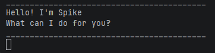

# Spike User Guide

Spike is a **command-line task manager chatbot** that helps you track tasks quickly and efficiently using simple text commands.

Spike supports the following task types:
- Todo tasks
- Deadline tasks
- Event tasks
- Finding tasks using keywords

Spike runs in the terminal and stores tasks locally so they persist between runs.



---

## Quick Navigation

- [list](#viewing-all-tasks--list)
- [todo](#adding-a-todo-task--todo)
- [deadline](#adding-a-deadline--deadline)
- [event](#adding-an-event--event)
- [mark](#marking-a-task-as-done--mark)
- [unmark](#unmarking-a-task--unmark)
- [delete](#deleting-a-task--delete)
- [find](#finding-tasks--find)
- [bye](#exiting-the-program--bye)

---

## Features

> 📝 **Note:** Words in `UPPER_CASE` are parameters to be supplied by the user.  
> e.g. in `todo DESCRIPTION`, `DESCRIPTION` is a parameter, such as `todo read book`.

---

### Viewing all tasks : `list`

Shows all tasks currently in the list.

Format: `list`

Example:
```
list
```

Expected output:
```
Here are the tasks in your list:
1.[T][ ] read book
2.[D][ ] submit assignment (by: Friday)
```

---

### Adding a todo task : `todo`

Adds a simple task with no date.

Format: `todo DESCRIPTION`

Example:
```
todo read book
```

Expected output:
```
Got it. I've added this task:
  [T][ ] read book
Now you have 1 tasks in the list.
```

---

### Adding a deadline : `deadline`

Adds a task with a deadline.

Format: `deadline DESCRIPTION /by TIME`

Example:
```
deadline submit report /by Friday
```

Expected output:
```
Got it. I've added this task:
  [D][ ] submit report (by: Friday)
Now you have 2 tasks in the list.
```

---

### Adding an event : `event`

Adds a task that occurs during a time range.

Format: `event DESCRIPTION /from START /to END`

Example:
```
event meeting /from 2pm /to 4pm
```

Expected output:
```
Got it. I've added this task:
  [E][ ] meeting (from: 2pm to: 4pm)
Now you have 3 tasks in the list.
```

---

### Marking a task as done : `mark`

Marks a task as completed.

Format: `mark TASK_NUMBER`

> 💡 **Tip:** Use `list` first to check the task numbers before marking.

Example:
```
mark 1
```

Expected output:
```
Nice! I've marked this task as done:
  [T][X] read book
```

---

### Unmarking a task : `unmark`

Marks a completed task as not done.

Format: `unmark TASK_NUMBER`

Example:
```
unmark 1
```

Expected output:
```
OK, I've marked this task as not done yet:
  [T][ ] read book
```

---

### Deleting a task : `delete`

Removes a task from the list permanently.

Format: `delete TASK_NUMBER`

> ⚠️ **Warning:** Deleted tasks cannot be recovered.

Example:
```
delete 2
```

Expected output:
```
Noted. I've removed this task:
  [D][ ] submit report
Now you have 2 tasks in the list.
```

---

### Finding tasks : `find`

Searches for tasks containing a keyword.

Format: `find KEYWORD`

> 💡 **Tip:** The search is case-sensitive. Use lowercase to match most tasks.

Example:
```
find book
```

Expected output:
```
Here are the matching tasks in your list:
1.[T][ ] read book
```

---

### Exiting the program : `bye`

Exits Spike. Tasks are saved automatically before closing.

Format: `bye`

Example:
```
bye
```

Expected output:
```
Bye. Hope to see you again soon!
```

---

## Command Summary

| Command    | Format                                          |
|------------|-------------------------------------------------|
| `list`     | `list`                                          |
| `todo`     | `todo DESCRIPTION`                              |
| `deadline` | `deadline DESCRIPTION /by TIME`                 |
| `event`    | `event DESCRIPTION /from START /to END`         |
| `mark`     | `mark TASK_NUMBER`                              |
| `unmark`   | `unmark TASK_NUMBER`                            |
| `delete`   | `delete TASK_NUMBER`                            |
| `find`     | `find KEYWORD`                                  |
| `bye`      | `bye`                                           |

---

## Saving

Spike automatically saves your tasks to:

```
data/spike.txt
```

Tasks are loaded automatically when the program starts again. You do not need to save manually.